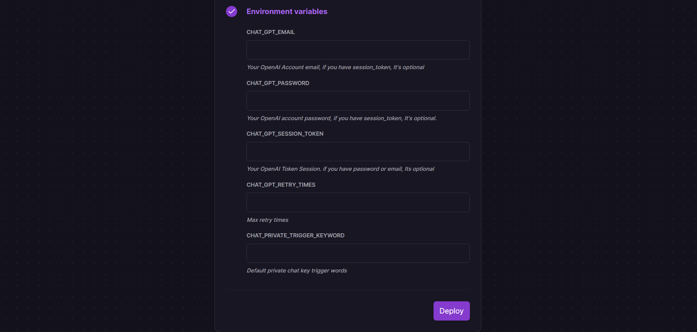
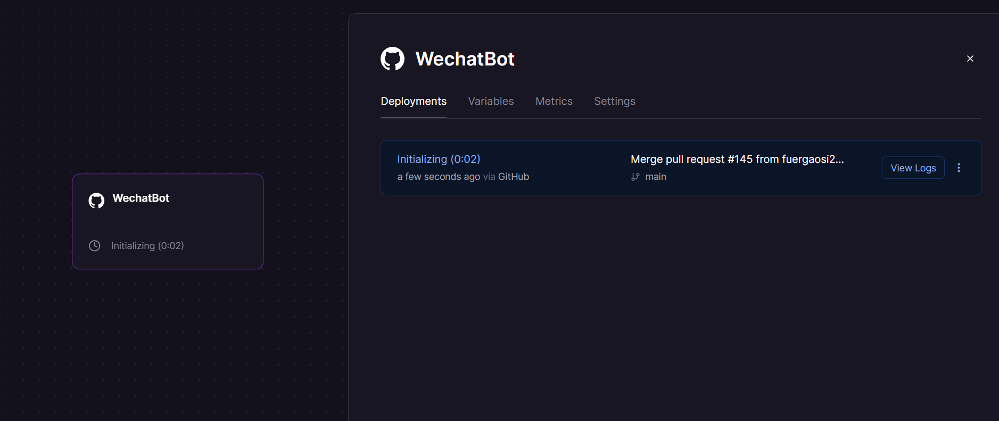
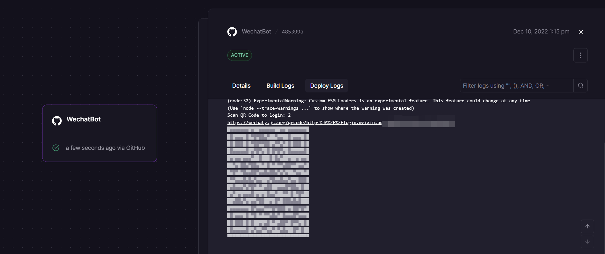
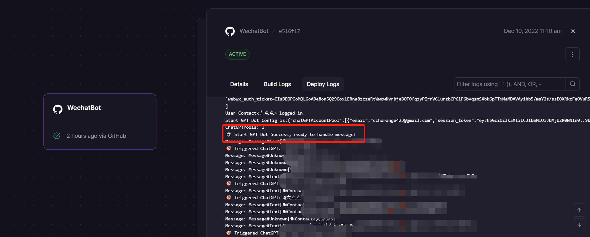

<h1 align="center">Welcome to wechat-chatgpt 👋</h1>
<p>
  
  <a href="#" target="_blank">
    
  </a>
  <a href="https://twitter.com/fuergaosi" target="_blank">
    
  </a>
</p>

> Use ChatGPT On Wechat via wechaty  
English | [中文文档](README_ZH.md)

[](https://railway.app/new/template/BHJD6L?referralCode=FaJtD_)  

If you don't have a server or want to experience rapid deployment, you can use Railway to do so, see [Usage with Railway](#usage-with-railway).

## 🌟 Feature

- [x] Use ChatGPT On Wechat via wechaty
- [x] Support OpenAI Accounts Pool
- [x] Support use proxy to login
- [x] Add conversation Support (Everyone will have their own session)
- [x] Add Dockerfile
- [x] Publish to Docker.hub
- [x] Add Railway deploy
- [x] Auto Reload OpenAI Accounts Pool
- [ ] Add sendmessage retry for 429/503

## Use with docker in Linux(recommended)

```sh
cp config.yaml.example config.yaml
# Change Config.yaml
# run docker command in Linux or WindowsPowerShell
docker run -d --name wechat-chatgpt -v $(pwd)/config.yaml:/app/config.yaml holegots/wechat-chatgpt:latest
# login with qrcode
docker logs -f wechat-chatgpt
```

## Use with docker in Windows

```sh
# Create and modify config.yaml in the current directory
# run docker command in WindowsPowerShell
docker run -d --name wechat-chatgpt -v $(pwd)/config.yaml:/app/config.yaml holegots/wechat-chatgpt:latest
# In the Windows command line (cmd) environment, you may mount the current directory like this:
docker run -d --name wechat-chatgpt -v %cd%/config.yaml:/app/config.yaml holegots/wechat-chatgpt:latest
# login with qrcode
docker logs -f wechat-chatgpt
```

## Upgrade docker image version

```sh
docker pull holegots/wechat-chatgpt:latest
docker stop wechat-chatgpt
docker rm wechat-chatgpt
# run docker command in Linux or WindowsPowerShell
docker run -d --name wechat-chatgpt -v $(pwd)/config.yaml:/app/config.yaml holegots/wechat-chatgpt:latest
# In the Windows command line (cmd) environment, you may mount the current directory like this:
docker run -d --name wechat-chatgpt -v %cd%/config.yaml:/app/config.yaml holegots/wechat-chatgpt:latest
# login with qrcode
docker logs -f wechat-chatgpt
```

## Install

```sh
npm install && poetry install
```

## Usage with manual

### Copy config

You need copy config file for setting up your project.

```sh
cp config.yaml.example config.yaml
```

### Get and config Openai account

> If you don't have this OpenAI account and you live in China, you can get it [here](https://mirror.xyz/boxchen.eth/9O9CSqyKDj4BKUIil7NC1Sa1LJM-3hsPqaeW_QjfFBc).

#### **A：Use account and password**

You need get OpenAI account and password.
Your config.yaml should be like this:

```yaml
chatGPTAccountPool:
  - email: <your email>
    password: <your password>
# if you hope only some keywords can trigger chatgpt on private chat, you can set it like this:
chatPrivateTiggerKeyword: ""
```

⚠️ Trigger keywords must appear in the first position of the received message.
⚠️ Pls make sure your network can log in to OpenAI, and if you fail to login in try setting up a proxy or using SessionToken.  
**Setup proxy:**

```sh
export http_proxy=<Your Proxy>
```

#### **B: Use Session Token**

If you cant use email and password to login your openai account or your network can't login, you can use session token. You need to follow these steps:

1. Go to <https://chat.openai.com/chat> and log in or sign up.
2. Open dev tools.
3. Open Application > Cookies.
   
4. Copy the value for \_\_Secure-next-auth.session-token and save it to your config
   Your config.yaml should be like this:

```yaml
chatGPTAccountPool:
  - session_token: <your session_token>
```

### Start Project

```sh
npm run dev
```

If you are logging in for the first time, then you need to scan the qrcode.

## Usage with Railway

[Railway](https://railway.app/) is a deployment platform where you can provision infrastructure, develop with that infrastructure locally, and then deploy to the cloud.This section describes how to quickly deploy a wechat-chatgpt project using Railway.

Firstly, you'll need to sign up for a Railway account and sign in using GitHub verification.

Then click the one-click deployment button below to deploy.

[](https://railway.app/new/template/BHJD6L?referralCode=FaJtD_)

After some validation is complete, you can begin the deployment.You will see the following interface:  

  

Some environment variables need to be configured:  

- **CHAT_GPT_EMAIL** : Your OpenAI Account email, if you have session_token, It's optional.

- **CHAT_GPT_PASSWORD** : Your OpenAI Account password, *if you have session_token, It's optional*.

- **CHAT_GPT_SESSION_TOKEN** : Your OpenAI Account session_token, *if you have email and password, It's optional*.See how to get a token [here](#b-use-session-token).

- **CHAT_GPT_RETRY_TIMES** : The number of times to retry when the OpenAI API returns 429 or 503.

- **CHAT_PRIVATE_TRIGGER_KEYWORD** : If you hope only some keywords can trigger chatgpt on private chat, you can set it.

Click the Deploy button and your service will start deploying shortly.The following interface appears to indicate that the deployment has begun:  

  

When the deployment is displayed successfully, click to view the logs and find the WeChat login link in Deploy Logs.  

  

Click to enter and use your prepared WeChat to scan the code to log in.

Log in successfully and start sending and receiving messages(This process can take several minutes):  



Besides, in deployment, you may encounter the following issues:  

- **Error: ⚠️ No chatgpt item in pool** : This error means that you have not configured the OpenAI account information correctly. You can solve this problem from the following aspects:1. Check whether the token or openAI account and password are filled in correctly. 2. The token may have expired (experience shows that the expiration time of the token is **24** hours), you can go to the chatGPT official website to re-obtain the token. 3. Redeploy Current Services.Note that the above should be modified on the Variables page in Railway Dashboard.
- **After the deployment is complete, the QR code is not generated**.Try **refreshing** the page to see again if the Deploy Logs panel generated a link and QR code.
- **The generated QR code cannot be scanned**.On the generated QR code, there is a link that can be clicked to scan the QR code.
- **Message feedback is very slow**.Because Railway's servers are deployed overseas, there is an increase in message feedback latency, but it is still within the acceptance range. If you are time sensitive, you can use your own server deployment.

## Author

👤 **holegots**

- Twitter: [@fuergaosi](https://twitter.com/fuergaosi)
- GitHub: [@fuergaosi233](https://github.com/fuergaosi233)

## 🤝 Contributing

Contributions, issues and feature requests are welcome!<br />Feel free to check [issues page](https://github.com/fuergaosi233/wechat-chatgpt/issues).

## Show your support

Give a ⭐️ if this project helped you!
